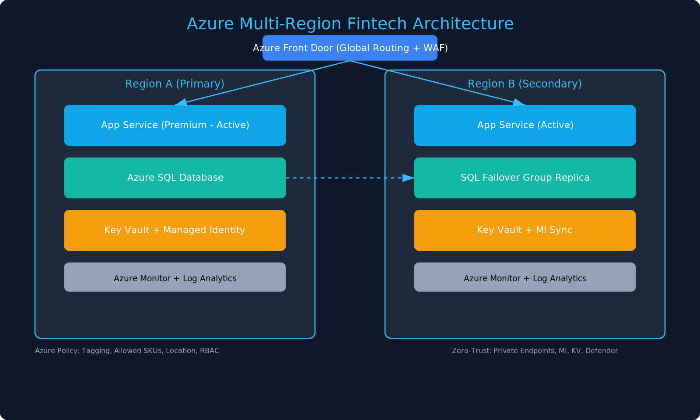

# Azure Multi-Region Fintech Architecture

> **Dark👣 Systems | Cloud Architecture Portfolio**

Enterprise-grade Azure reference implementation for a multi-region, compliance-focused fintech platform.

## Highlights
- Global entry with **Azure Front Door (WAF)** and geo-routing
- **App Service (Premium)** in active/active across two regions
- **Azure SQL Failover Group** for cross-region HA
- **Zero-Trust**: Private Endpoints, **Managed Identity**, **Key Vault**
- Governance with **Azure Policy** and Ops with **Monitor + Log Analytics**
- **Terraform** IaC (modular, remote backend)

## Diagram


## Deploy (Terraform)
```bash
cd terraform
terraform init
terraform plan
terraform apply
```

> Set the remote backend storage account/container in `terraform/backend.tf` before apply.

## Repo Structure
```
docs/                  # Case study, diagram, PDF
terraform/             # IaC with modules
  modules/
    appservice/        # App Service Plan + Web App + VNet integration
    sql/               # SQL Server + DB + Failover Group
```

## Author
**Ayobamidele “Dark👣” Aderosoye**  
- LinkedIn: https://www.linkedin.com/in/ayobamidele-aderosoye  
- GitHub: https://github.com/Aderosoye  
- Email: adroyphill@gmail.com

## License
MIT © 2025 Ayobamidele Aderosoye
